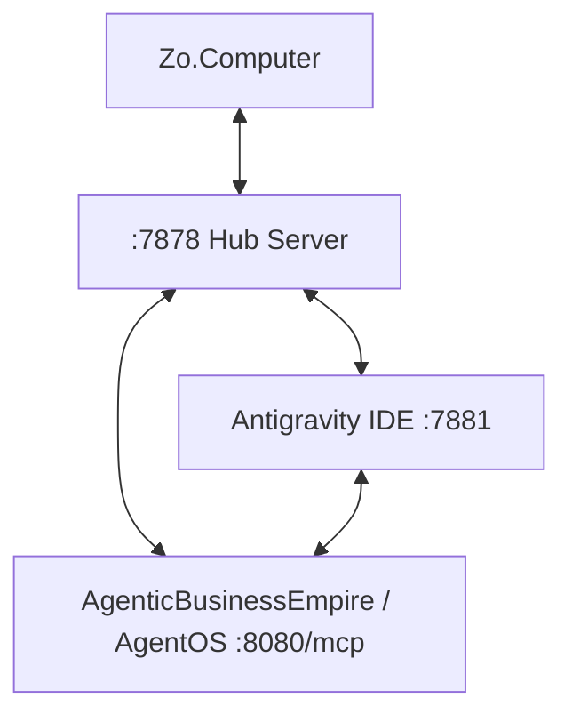

# Agentic Business Empire (AgentOS)

**AgentOS v1.0-GENESIS (Currently v0.9.2)**

A premium, self-sovereign, conglomerate-scale **Business Operating System** that replaces human-centric project timelines with silicon-speed Compute-Time-to-Completion (CTC) execution under the **Zero-Latency Mandate**.

AgentOS is designed as a fully autonomous kernel capable of end-to-end global subsidiary management.

## 🚀 Core Architecture

At its heart, AgentOS leverages a **3-Way Model Context Protocol (MCP) Mesh** (Zo ↔ Antigravity ↔ AgenticBusinessEmpire) creating a unified, peer-to-peer autonomous workspace. Every node acts as both an **MCP Server** (providing tools) and **MCP Client** (delegating to peers).



## 🏢 Enterprise Features

* **Autonomous Workforce Delegation Engine**: Granular corporate hierarchical communication and AI-driven task delegation.
* **The Pulse**: A recursive autonomous heartbeat loop driving multi-tier operations.
* **Master Ledger**: Sharded financial settlement (Stripe integration), departmental budgeting, and automated tax provisioning.
* **Global Command Bus**: Centralized message and action passing for the entire compute fabric.
* **Live GitHub AI Integration**: Autonomous PR reviews, intelligent merging, and repository lifecycle management.
* **Native Voice Stack (STT/TTS/IVR)**: Live conversational interfaces to negotiate and direct business logic.
* **6-Stage Corporate Lifecycle**: Autonomously shepherds entities through: *Blue Ocean* ➡ *Idea* ➡ *Validation* ➡ *Project* ➡ *Division* ➡ *Subsidiary* ➡ *Exit*.

## 🔌 Ecosystem Integrations

AgentOS operates natively in the real world with live API hooks into:
* **Productivity & Docs**: Notion, Google Workspace, Airtable.
* **Engineering**: Linear, GitHub.
* **Communication**: Native SMTP, SMS, LinkedIn.

## 📱 Cross-Platform Cockpit

A unified dashboard UI powered by a **Tauri v2** architecture, exposing a Mobile Cockpit and Native Linux/Android applications for real-time conglomerate governance. Live monitoring features 8 tabs:
`Events` · `Workspace` · `Commands` · `Features` · `Secrets` · `Extensions` · `Messages` · `Actions Log`

## 🏁 Quick Start (Mesh Genesis)

1. **Install Dependencies**:
   ```bash
   ./scripts/install.sh
   ```

2. **Launch The Pulse / Mesh**:
   ```bash
   python3 main.py mesh
   ```
   *Starts Hub (:7878), IDE Server (:7881), and Dashboard (:7880).*

3. **Connect Peers**:
   - **Zo**: Add integration using `mcp_config_zo.json`.
   - **Antigravity**: Configure using `mcp_config_antigravity.json`.
   - **AgentOS**: Register via `register_peer` tool using `mcp_config_agenticbusinessempire.json`.

## 🔒 Security & Accountability

Every action taken by any agent is logged as a JSONL entry in `shared/actions.log`, creating an immutable, cross-agent audit trail.
* **Mutual API Key Auth**: All peer-to-peer calls are validated with HMAC-SHA256.
* **Encrypted Vault**: Agent secrets are stored in `.vault/` using AES-256-GCM.
* **Rogue Isolation Test Suites**: Ensuring all autonomous edge cases are containerized safely.
