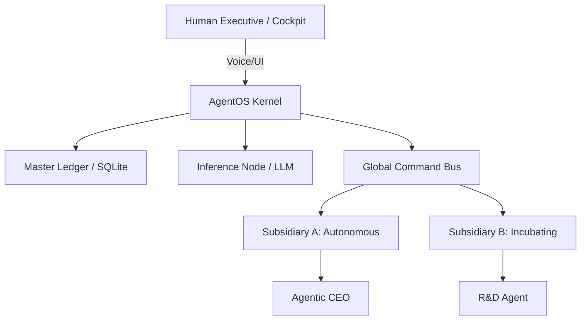

# 🌌 AgentOS: The Conglomerate Operating System

**AgentOS** is the world's first decentralized **Incubator-to-Holding** Business Operating System. It allows Bxthre3 Inc. to build, validate, and spin off autonomous corporate subsidiaries with 100% AI-led governance.

---

## 🏛️ Ecosystem Overview
AgentOS isn't just a kernel; it's a factory for companies. It manages a **Unified Workforce** of Agents, Humans, and Robots across multiple corporate entities.

### 🚀 Key Features
- **Incubator Lifecycle**: Seamless transition from `INCUBATING` -> `AUTONOMOUS` -> `SPIN-OFF`.
- **Strategic Intelligence**: Auto-Task Identification from roadmaps and autonomous "Pivot Protocol."
- **Master Ledger**: Hardened AES-256 encrypted SQLite ledger sharded by `CompanyID`.
- **Multimodal OS**: Native Voice COMMAND (STT/TTS) and Live Strategy Meeting handlers.
- **Unified Persona Registry**: Specialized AI roles (CEO, HR, Ops, Security, R&D).

---

## 🔗 Deep Integrations
AgentOS is the bridge between AI logic and the tools your business depends on:
- **Productivity**: Google Workspace (Calendar/Drive), Airtable, Notion, Linear.
- **Communication**: Native SMS, Email protocols, Slack, and Discord.
- **Finance**: DeFi (Uniswap/Aave) and legacy ERP synchronization.
- **Management**: Integrated Open Source CRM and Workforce Ledger.

---

## 🛠️ Architecture

---

## 📅 Roadmap to v1.0 Production
- [x] Multi-Tenant Encrypted Ledger.
- [x] Persona & Workforce Registry.
- [x] Strategic Milestone Decomposition.
- [ ] Native Voice STT/TTS Implementation.
- [ ] Strategy Meeting Live Handlers.
- [ ] Bxthre3 "War Room" Dashboard.

---

© 2026 **Bxthre3 Inc.** All Rights Reserved. 
Designed for the Foxxd S67 and Kali/Linux Cockpits. Powered by Zo Hosted Cloud.
